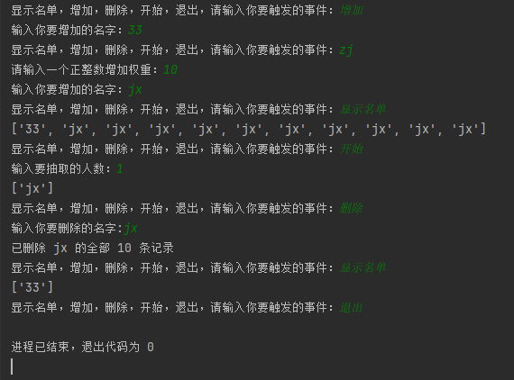

# 兴兴的抽奖系统 - Weighted Lottery Draw

一个高中时自己写的简易命令行抽奖工具，支持**权重抽奖**（某人中奖概率更高），纯 Python 实现，适合班级/群里娱乐抽奖用。

## 功能亮点

- 支持普通添加成员
- 支持权重增加（输入 'zj' 命令，设置权重数字，权重越高中奖概率越大）
- 支持删除成员（自动删除所有权重实例）
- 显示当前抽奖池（带权重统计）
- 随机抽取指定人数（防无效输入）
- 简单命令行交互，中文友好

## 使用方法

1. 安装 Python（3.6+ 即可，无需额外库）
2. 下载代码或克隆仓库
3. 运行 `python lottery.py`（假设文件名是 lottery.py）

### 支持的命令

| 命令     | 说明                     | 示例输入                  |
|----------|--------------------------|---------------------------|
| 显示名单 | 查看当前池子和权重       | 显示名单                  |
| 增加     | 添加成员（默认权重1）    | 增加 → 输入名字           |
| zj       | 加权重添加成员           | zj → 输入权重 → 输入名字  |
| 删除     | 删除成员（全权重清零）   | 删除 → 输入名字           |
| 开始     | 开始抽奖                 | 开始 → 输入抽取人数       |
| 退出     | 结束程序                 | 退出                      |

## 技术实现

- 语言：Python 3
- 核心机制：权重通过**名字重复添加**实现（简单粗暴但有效）
- 随机抽取：`random.sample()`（不放回抽样）
- 输入防错：try-except + 边界检查
- 显示优化：`collections.Counter` 统计权重

## 待优化/未来计划

- 保存抽奖池到文件（json/txt），下次运行自动加载
- 改用字典 + `random.choices(weights=...)` 实现不重复名字的权重抽奖
- 加 Tkinter 图形界面（输入框 + 中奖动画）
- 支持导出中奖名单

欢迎 star、fork、提 issue 笑我代码（狗头）～

**作者**：兴兴  
**创作时间**：2026年2月11日
**最后更新**：2026年2月11日

